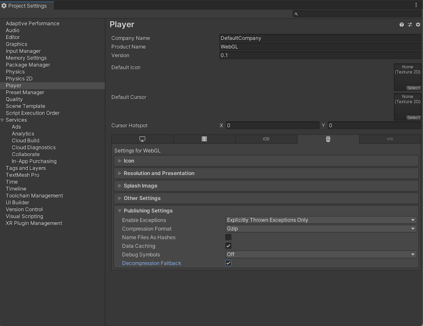

+++
title = "Embedding Guide"
weight = 100

[taxonomies]
Categories = ["Account"]
+++
Since Ludum Dare 51, we now support uploading and embedding on game pages.

Uploading to Ludum Dare is not required, but some features (embedding) are only supported if you upload.


## Downloads
We support many common file formats. If you're not sure what to use, we recommend `zip`. Files are uploaded from your game page. Simply edit them (click the pencil icon the bottom corner), scrolling to the "Downloads" section, and click the **upload** button.


### Details
* Supported file extension(s):
  * Archive: `zip`, `tar.gz`, `tar.bz2`, `7z`, `rar`
  * Microsoft: `msi`, `exe`, `com`
  * Apple: `dmg`, `ipa`
  * Linux: `flatpak`, `snap`, `appimage`, `deb`, `rpm`, `pkg`, `apk` (Android)
  * Document: `pdf`, `epub`, `txt`
  * Legacy: `jar`, `swf`
* Max file size: 256 MB

**IMPORTANT**: Embedded games have different restrictions. See below for details.

GitHub discussion for additional formats: <https://github.com/JammerCore/JammerCore/discussions/2171>

## Embedding
You can embed web games directly on a game pages. We support HTML5 games 

To upload, you must prepare a `zip` file with all of your files, and an `index.html` file in the root (top-level folder). Your `zip` file can be uploaded via the **upload** button in the **Embedding** section.

**IMPORTANT**: Web games run in a strict sandbox! See the **JavaScript Restrictions** section below.

### Details
* Supported file extension(s):
  * Archives: `zip`
* Max file size: 256 MB

### File structure 
* `index.html` in the root directory of the ZIP file
  * (TODO: Allow users to change this)

### Layout Restrictions
* 948x533 pixel resolution (16:9)
  * (TODO: Allow users to change this)

### JavaScript Restrictions
* no external requests (`fetch`, `XMLHttpRequest`)
* no storage or cookies (`localStorage`, `sessionStorage`, `indexDB`)

### Supported JavaScript features
Our embeds are a standard `<iframe>`. You should be able to use any feature supported by modern browsers (other than those mentioned above). Features that require non-standard configurations or permissions are listed below.

* `requestFullScreen()`
* Performance features, via [cross-origin isolation](https://web.dev/cross-origin-isolation-guide/) (`SharedArrayBuffer`, high resolution timers)
* WebAssembly Content-Type (`application/wasm`)
* [Unity Content-Encoding formats](https://docs.unity3d.com/Manual/webgl-deploying.html) (`gzip`, `br`)

GitHub discussion on additional browser features: https://github.com/JammerCore/JammerCore/discussions/2172

### Mobile
We've been focused on the desktop experience, and though it should still work, the mobile web-game experience might be sub-par.

GitHub issue: <https://github.com/JammerCore/JammerCore/issues/2169>

### Persistent storage
At the time of this writing, embedded games don't support persistent storage. We are exploring some options, but to keep things secure we will not be enabling access to a traditional storage method.

GitHub issue: <https://github.com/JammerCore/JammerCore/issues/2170>

### Accessing external data
For privacy and security reasons, we will not be allowing access to external websites or data. If your game requires external data, we recommend hosting it yourself and linking it.

### Embedding embedded Ludum Dare games on other websites
At the time of this writing this is unsupported. If there's enough interest, we may add this.

GitHub discussion: <https://github.com/JammerCore/JammerCore/discussions/2173>

## Exporters

### Unity


Unity's WebGL exporter should work as soon as you do the following. 

* Disable **Data Caching** [(requires IndexedDB)](https://docs.unity3d.com/ScriptReference/PlayerSettings.WebGL-dataCaching.html)

We support Brotli (best) and Gzip compression. ([MDN](https://developer.mozilla.org/en-US/docs/Web/HTTP/Headers/Content-Encoding), [CanIUse](https://caniuse.com/brotli))

More information: <https://docs.unity3d.com/Manual/webgl-deploying.html>

### Godot
Disable PWA.


We're still investigating, but we've heard from some people that that replacing the `if` checks for `('serviceWorker' in Navigator)` with `false` in the `.js` file fixes the Service Worker error.


### libGDX
Edit `html.nocache.js` and replace `document.compatMode` with the string `"CSS1Compat"`.


## Troubleshooting

#### "Uncaught DOMException: Failed to execute 'texImage2D' on 'WebGLRenderingContext': The cross-origin image at ..." or "Uncaught DOMException: The operation is insecure."
Problem: `texImage2D` doesn't have permission to read image resources.

Solution: Get permission to read by setting `crossOrigin` on your `Image`'s request. Passing an empty string or `'anonymous'` to `crossOrigin` makes it an anonymous CORS request ([MDN](https://developer.mozilla.org/en-US/docs/Web/API/HTMLImageElement/crossOrigin)).

```javascript
const gl = document.createElement("canvas").getContext("webgl");
const tex = gl.createTexture();
gl.bindTexture(gl.TEXTURE_2D, tex);

loadImage('asset/player1.png');

function loadImage(url) {
  const img = new Image();
  img.onload = () => {
    // load the texture into VRAM. this fails if you don't have permission to access the response
    gl.texImage2D(gl.TEXTURE_2D, 0, gl.RGBA, gl.RGBA, gl.UNSIGNED_BYTE, img);
  };
  img.crossOrigin = ''; // ask for (anonymous) permission to access the response
  img.src = url;        // triggers the request (setter)
}
```
Because of the `img.crossOrigin = ''` line, the request for `asset/player1.png` includes an `Origin: null` HTTP header. Our server responds with an `Access-Control-Allow-Origin: *` HTTP header, which is how the browser knows you have permission to read it.

More details: <https://stackoverflow.com/a/46461959>

